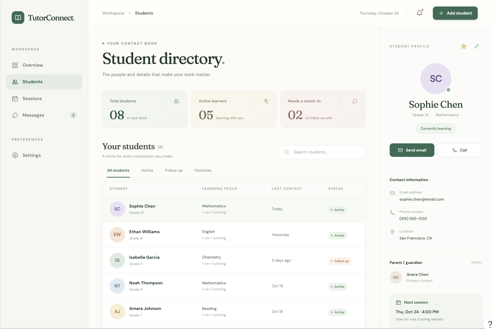

# TutorConnect

**TutorConnect** is a desktop application designed for **freelance private tutors** to organise student contacts, track lesson schedules, and manage parent communications. Optimized for fast typists, it combines the speed of a Command Line Interface (CLI) with the convenience of a Graphical User Interface (GUI).

* **Target User:** Freelance private tutors managing multiple students and parents across different academic levels.
* **Fast Keyboard-Driven Workflow:** Add records, update lesson notes, and query schedules without touching a mouse.
* **Organised Directories:** Group students by subject, grade level, and recurring time slots.
* For the detailed documentation of this project, see the **[TutorConnect Product Website](https://ay2627s1-cs2103t-f08-3.github.io/tp/)**.
* If you are interested in using TutorConnect, see the **[User Guide](docs/UserGuide.md)**.
* If you are interested in contributing or extending this project, see the **[Developer Guide](docs/DeveloperGuide.md)**.

---

* This project is based on the AddressBook-Level3 project created by the [SE-EDU initiative](https://se-education.org).